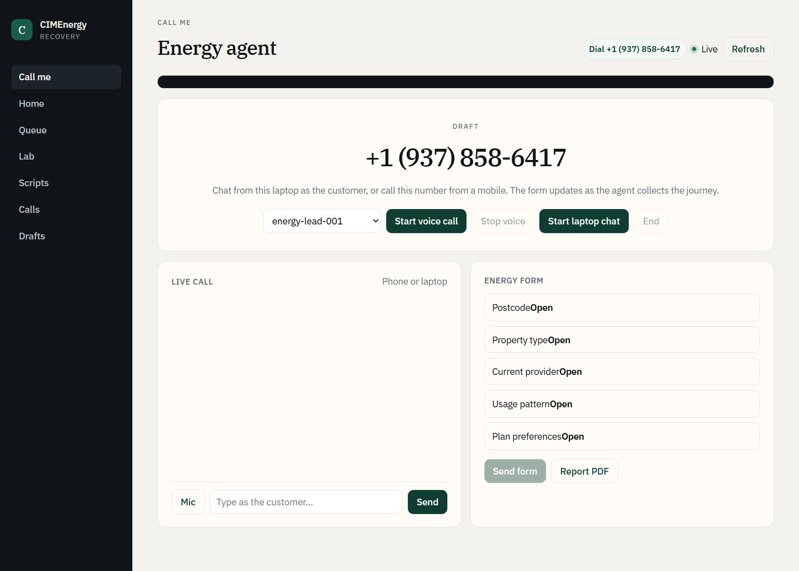
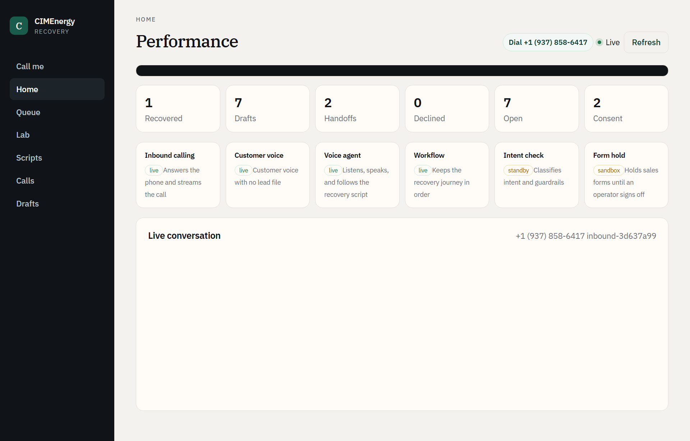
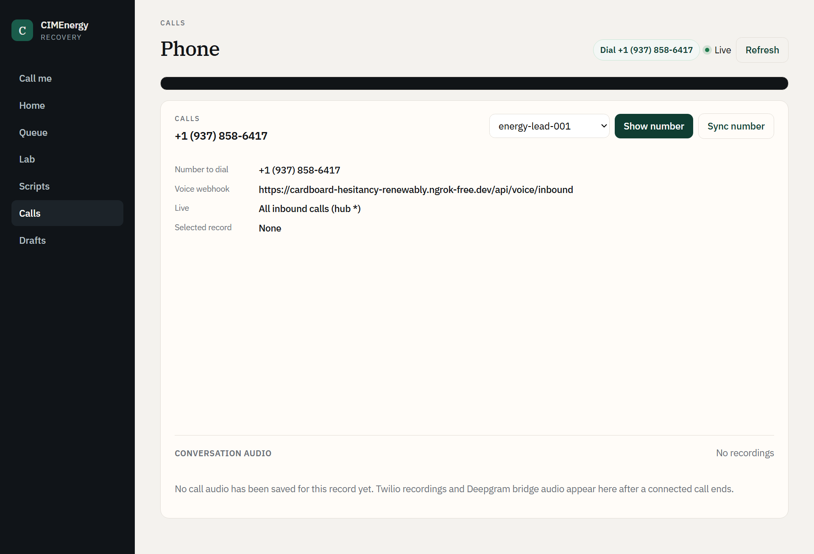
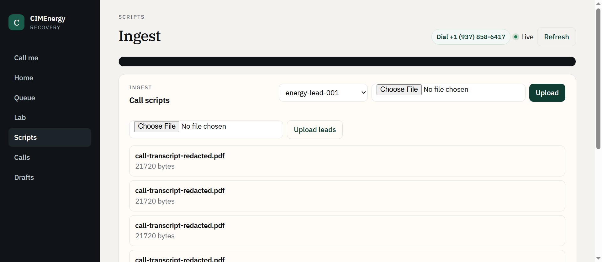
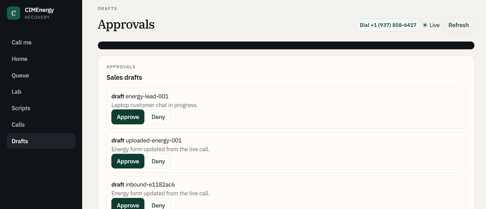
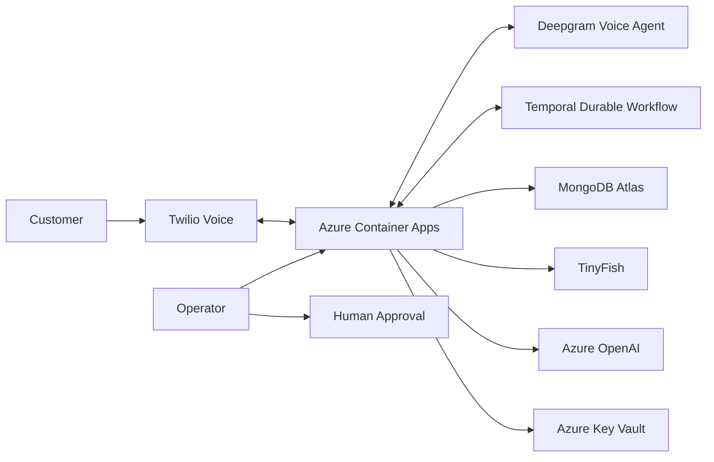

# CIMEnergy Recovery

## Enterprise Voice AI for Recovering Dropped Energy Journeys

CIMEnergy is a voice-first recovery workflow for Energy businesses. It reconnects with incomplete customer journeys, captures only the remaining information, applies deterministic guardrails, and routes sensitive cases to human operators.

> **Business value:** recover incomplete journeys with less repetitive follow-up work while keeping consent, DNC, advice, payment, and escalation decisions controlled and auditable.



## 1. C-Suite Business Case

| Business challenge | CIMEnergy response |
|---|---|
| Abandoned Energy journeys | Automated voice recovery |
| Manual follow-up workload | Guided AI conversation |
| Inconsistent handling | Deterministic backend guardrails |
| Sensitive customer requests | Human handoff |
| Limited operational visibility | Calls, events, transcripts and KPI evidence |
| Cloud security requirements | Azure deployment + Key Vault secret management |

## 2. Executive Workflow

```text
Dropped-off customer journey
          ↓
      DNC check
          ↓ clear
 Voice call + disclosure
          ↓ consent
 Recover missing fields
          ↓
   Guardrail decision
   ├─ Advice → human
   ├─ Payment → stop + human
   ├─ Stop calling → end
   └─ Uncertainty → handoff
          ↓
 Validate + approve
          ↓
 Submit test journey
          ↓
 Complete + audit outcome
```

## 3. Step-by-Step Customer Recovery

1. **Identify** — load a synthetic dropped-off Energy lead.
2. **Protect** — check DNC status before dialling.
3. **Consent** — disclose recording and obtain affirmative consent.
4. **Recover** — ask focused questions for missing journey fields.
5. **Validate** — confirm structured answers before submission.
6. **Guardrail** — stop automation for advice, payment, refusal, confusion, or human-help requests.
7. **Approve** — operator reviews the draft action.
8. **Complete** — submit the approved test payload and log the outcome.

## 4. Performance Dashboard



Operations can monitor recovery activity, drafts, handoffs, declines, consent state, open work, and live-call status.

## 5. Voice Operations



The voice console centralizes the test number, selected lead, webhook, call state, and recording availability.

## 6. Script & Lead Ingestion



Controlled synthetic leads and scripts make the recovery workflow repeatable for demos, testing, and QA.

## 7. Human-in-the-Loop Approval



Draft actions remain visible to an operator so a human can approve or deny the final journey action.

## 8. Enterprise Architecture



## 9. Technology & Business Role

| Technology | Role |
|---|---|
| Twilio | Customer voice connection and call routing |
| Deepgram | Real-time voice interaction |
| FastAPI | API, business rules, tools and dashboard updates |
| Temporal | Durable workflow state and recovery |
| MongoDB Atlas | Leads, transcripts, events, audio and reports |
| TinyFish | Approved form journey automation |
| Azure OpenAI | KPI/report analysis |
| Azure Container Apps | Application hosting |
| Azure Key Vault | Production secret storage |

## 10. Azure Enterprise Deployment

The application is designed for Azure enterprise deployment. The application runs in Azure Container Apps, while production credentials are kept outside the codebase and stored in **Azure Key Vault**.

```text
GitHub
   ↓
Container Build
   ↓
Azure Container Registry
   ↓
Azure Container Apps
   ├── FastAPI / Dashboard
   ├── Voice WebSocket
   └── Managed configuration
           ↓
     Azure Key Vault
```

**Security principle:** `.env` is for local development only. Production secrets should remain in Azure Key Vault and must not be committed to Git.

## 11. Guardrails

| Boundary | Automated behaviour |
|---|---|
| DNC blocked/unknown | Do not dial; record decision |
| Consent declined | Stop collection and end politely |
| Advice requested | No recommendation; offer human handoff |
| Payment/card mentioned | Stop voice capture; do not retain payment value; hand off |
| Customer says “stop calling” | End immediately and suppress recovery |
| Low confidence/confusion | Do not invent data; confirm or escalate |

## 12. Demo Narrative

```text
Customer drops journey
        ↓
AI initiates governed recovery
        ↓
Missing information is captured
        ↓
Sensitive exceptions go to a human
        ↓
Operator approves
        ↓
Journey is completed
        ↓
Management sees operational evidence
```

## 13. Demo Scenarios

- Successful recovery and test submission
- Recording/consent decline
- Advice request → human handoff
- Payment mention → protected handoff
- Customer says “stop calling” → immediate termination
- Confusion or low confidence → human escalation

## 14. Local Setup

```powershell
python -m venv .venv
.\.venv\Scripts\Activate.ps1
pip install -r requirements.txt
python -m backend.app.main
```

Open `http://127.0.0.1:8000`.

For local Twilio testing:

```powershell
ngrok http 8000
```

## 15. Required Credentials

Keep local values in `.env` for development and use Azure Key Vault for production.

```text
MONGO_URI
DEEPGRAM_API_KEY
TWILIO_ACCOUNT_SID
TWILIO_AUTH_TOKEN
TWILIO_PHONE_NUMBER
TEMPORAL_API
TEMPORAL_NAMESPACE
TEMPORAL_ID
AZURE_API_KEY
AZURE_ENDPOINT
AZURE_LLM_MODEL
TINYFISH_API
```

## 16. Repository Structure

```text
backend/                  FastAPI + voice workflow
frontend/                 Operator dashboard
infra/                    Azure infrastructure
scripts/                  Azure deployment + Twilio configuration
docs/doc3_assets/         Product screenshots
test/                     Integration tests
testing transcripts/      Workflow test evidence
.github/workflows/        CI/CD
```

## 17. Outcome

CIMEnergy combines **voice automation, durable workflows, deterministic guardrails, human approval, and Azure enterprise deployment** to turn abandoned Energy journeys into controlled recovery opportunities.

> Prototype uses synthetic/test data and test numbers. It does not collect payment credentials or provide product/financial advice.

## 18. Input → Processing → Output
### Successful Recovery
**Input:** `energy-lead-001`, synthetic lead, DNC=`clear`.
**Input:** Existing postcode=`3000`; next step=`property_type`.
**Input:** Recording consent=`granted`.
**Input:** Property type=`house`; provider=`synthetic-provider-a`.
**Input:** Usage pattern=`standard`; additional details=`none`.
**Process:** Ask one question at a time for remaining fields.
**Process:** Validate answers as structured journey data.
**Process:** Confirm completed fields and validate the Pydantic payload.
**Process:** Submit only to the sandbox/mock journey.
**Output:** `test_payload_submitted` → `journey_completed`.
**Output:** Lead outcome=`completed`; call=`call_ended`.

### Consent Decline / Opt-Out
**Input:** `energy-lead-007`, synthetic lead, DNC=`clear`.
**Input:** Recording consent=`declined`.
**Process:** Stop before collecting journey information and record `consent_declined`.
**Output:** No journey fields or payload are created.
**Output:** Outcome=`declined`; `call_ended` is recorded.
**Input:** Customer says “Stop calling me.”
**Process:** Treat the request as terminal; record `customer_declined` and suppress recovery.
**Output:** No retry or pressure loop is created.

### Advice / Human Handoff
**Input:** `energy-lead-005`, synthetic lead, DNC=`clear`, consent=`granted`.
**Input:** Customer asks which provider or plan saves most money.
**Process:** Trigger `advice_boundary_triggered`; provide no recommendation.
**Output:** Offer a human handoff with safe journey context.
**Input:** Customer asks where to provide a card number.
**Process:** Trigger `payment_boundary_triggered` and stop voice collection.
**Process:** Never request, repeat, store, or submit payment values.
**Output:** Handoff is created without payment data.
**Output:** Automated state=`handoff_required` or `handed_off`.

### Executive I/O Contract
**Input:** Dropped Energy journey, customer voice, and current state.
**Process:** DNC → consent → bounded recovery → validation → approval.
**Process:** FastAPI owns protected decisions and tool execution.
**Process:** Voice AI handles conversation; protected state remains backend-controlled.
**Process:** Temporal maintains durable workflow state across interruption.
**Process:** MongoDB records safe leads, events, transcripts, audio, and reports.
**Process:** Azure Key Vault provides protected production secrets.
**Output:** Completed journey, declined journey, or human handoff.
**Output:** Auditable state transitions and operator-visible evidence.
**Output:** KPI/reporting data for operational review.
**Business value:** Automate repetitive recovery while controlling escalation and risk.
**Operational input:** Current lead status and remaining journey step.
**Operational output:** Updated lead, call events, and approval state.
**Control output:** Protected exceptions are escalated instead of forced through automation.
